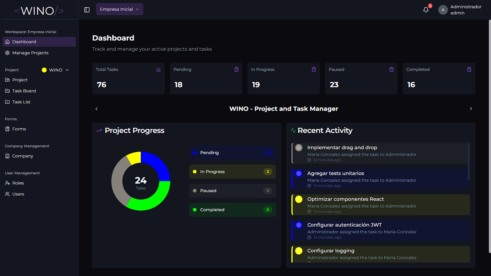
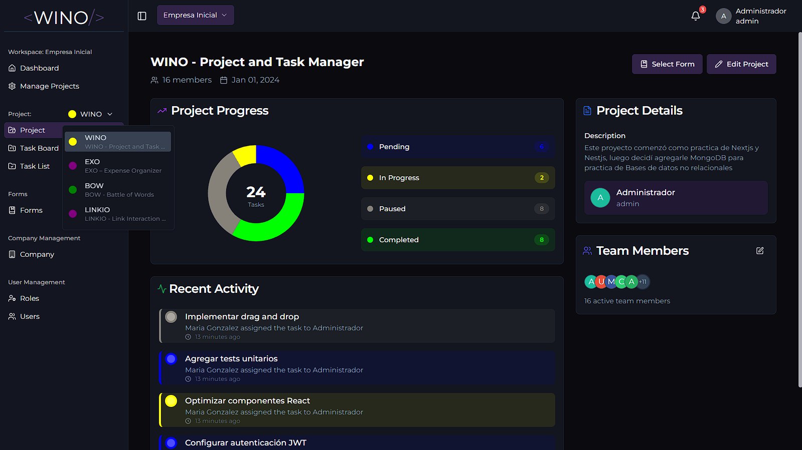
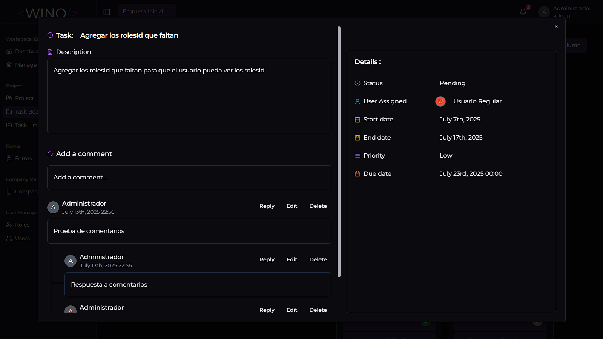
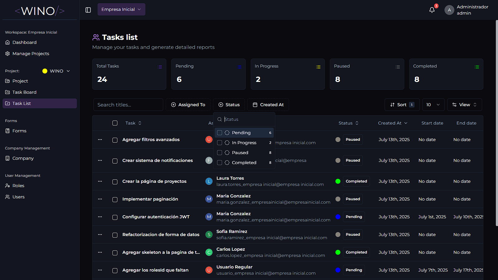
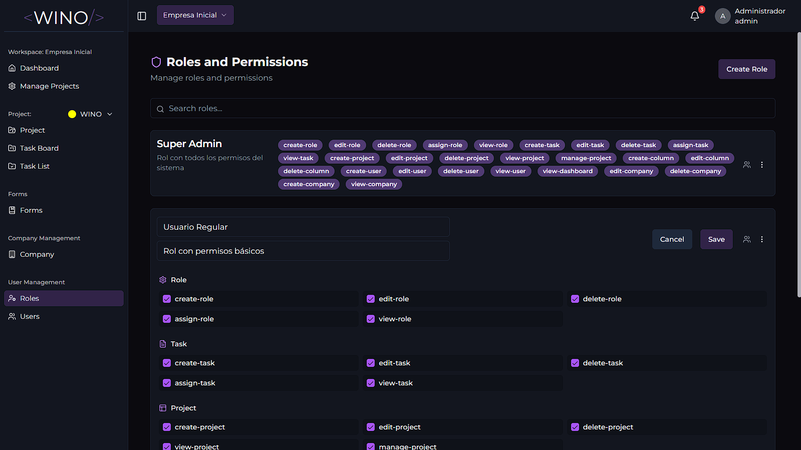
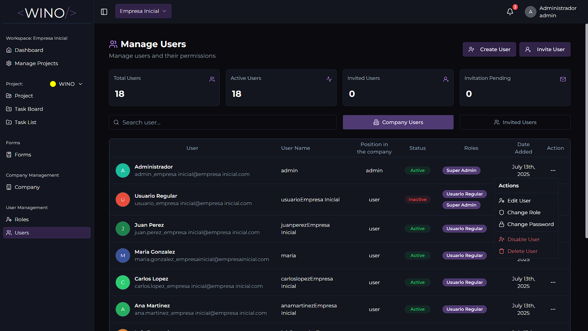
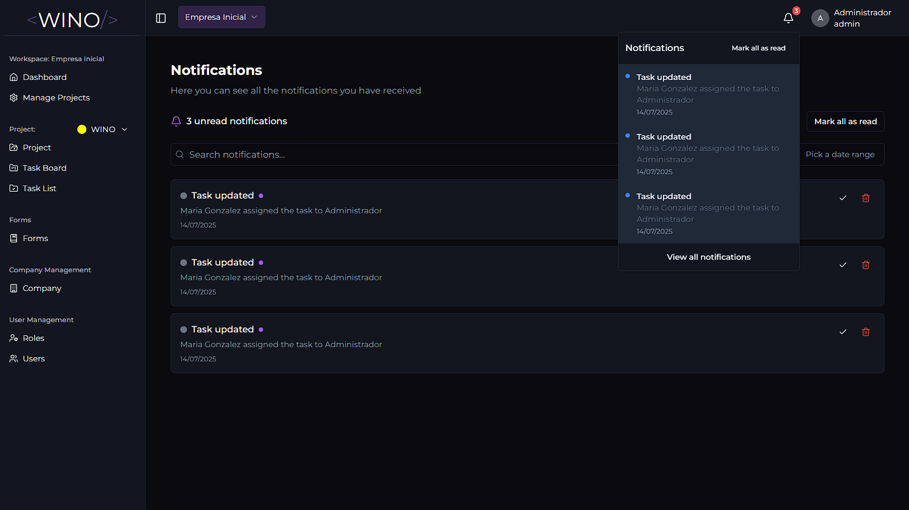
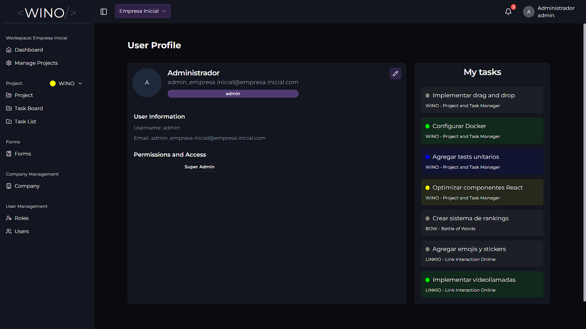

# Wino NextJS - Project And Task Management

Multi-company web application for project and task management,
developed with Next.js and NestJS. Implements JWT authentication, role
and permission-based access control, task assignment, Kanban board,
and project progress tracking with a modern and efficient interface.

## 🚀 Features

- JWT Authentication
- Role and permission-based access control
- Task assignment
- Kanban board
- Project progress tracking
- Modern and efficient interface

## 🛠️ Main Technologies

- [Next.js](https://nextjs.org/) - React Framework
- [TypeScript](https://www.typescriptlang.org/) - Programming Language
- [Tailwind CSS](https://tailwindcss.com/) - CSS Framework
- [Radix UI](https://www.radix-ui.com/) - Primitive Components
- [Zustand](https://zustand-demo.pmnd.rs/) - State Management
- [React Query](https://tanstack.com/query/latest) - Server State Management
- [NextAuth.js](https://next-auth.js.org/) - Authentication
- [React Hook Form](https://react-hook-form.com/) - Form Handling
- [Zod](https://zod.dev/) - Schema Validation

## 📦 Installation

1. Clone the repository:

```bash
git clone https://github.com/AlexanderOI/wino-nextjs.git
cd wino-nextjs
```

2. Install dependencies:

```bash
pnpm install
```

3. Copy the environment variables file:

```bash
cp .env.example .env
```

4. Configure environment variables in `.env`:

- `NEXT_PUBLIC_BACKEND_URL`: Your backend url
- `NEXTAUTH_URL`: Your auth url
- `NEXTAUTH_SECRET`: Your auth secret key

The backend can be found in the [wino-nestjs](https://github.com/AlexanderOI/wino-nestjs) repository

## 🚀 Local Development

To start the development server:

```bash
pnpm dev
```

The application will be available at `http://localhost:3000`

## 🏗️ Production Build

1. Build the application:

```bash
pnpm build
```

2. Start the production server:

```bash
pnpm start
```

## 📝 Available Scripts

- `pnpm dev` - Starts the development server with Turbopack
- `pnpm build` - Builds the application for production
- `pnpm start` - Starts the production server
- `pnpm lint` - Runs the linter

## 📸 Screenshots

<div>
    </img> 
    </img> 
    </img> 
    </img> 
    </img> 
    </img> 
    </img> 
    </img> 
    </img> 
    </img> 
    </img> 
    </img> 
</div>
